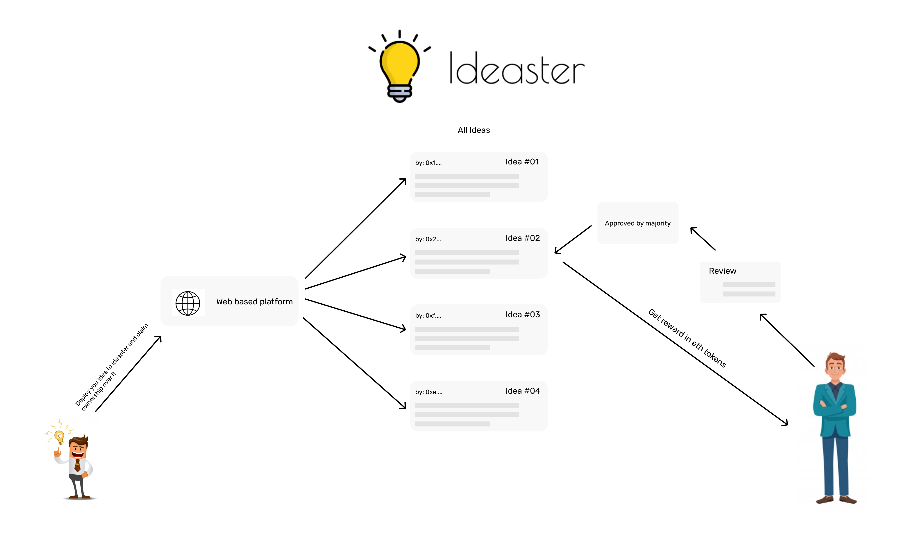

<p align="center">

 </p>
 
<h3 align="center"> An idea to test your idea </h3>

<p align="center"> <em> A decentralized way to test your ideas !! </em>.</p>


<h2> 🤔 The Problem it solves  </h2>
<p>
Many times it happens that we think about an idea, we discuss it with our friends and get to know their thoughts and opinions over it. But, actually to reach the stage of implementation, we need to make sure that our idea actually has a potential in it + We need to prove our ownership over the idea. The best experiment for testing potential we can do is testing the relevance of ideas for the group of society who will actually benefit with it or to know the constructive opinions of people. At the same time to get the actual opinions one needs to work at ground level which proves to be an hectic task and not remote friendly. So considering this as problem statement for our rescue here comes <b>ideaster (idea + tester)</b  
</p>


<h2>💡 The IDEA: </h2> 
<p>
Ideaster is a self reliant de-centralized platform built on the top of rinkeby test network to perform two major functions: </p>

- Bring verifiablilty for user for his non consumerable good(idea).
- Get constructive opinions from people over your idea. 

<h2>👨‍💻 How does it works </h2>
<p align="center">

 </p>

## 📷 Sneak peak: 
<p align="center">

 </p>

## 💻 Tech Stack Used
```
Blockchain:
- Smart contracts: Solidity
- Testing:         mocha.
- Network:         Rinkeby test network
- Interaction:     Web3

Frontend:
- UI Library:      Reactjs
- Bootstraped Components:         Semantic-ui-react

- Supporting database
- Firebase
```
## Contributing

Any suggestions, improvements or bug reports are welcome.

- If you want to discuss any aspect of the project, please use the [Discussions Tab](https://github.com/nlok5923/Ideaster-BC/discussions).
- You can submit your idea by [opening an issue](https://github.com/nlok5923/Ideaster-BC/issues/new/choose) or [creating a Pull Request](https://github.com/nlok5923/Ideaster-BC/pulls).
- If you'd like to improve the code, make sure you stick to the existing code style and naming conventions.


## License

This project is licensed under the terms of the MIT license.
