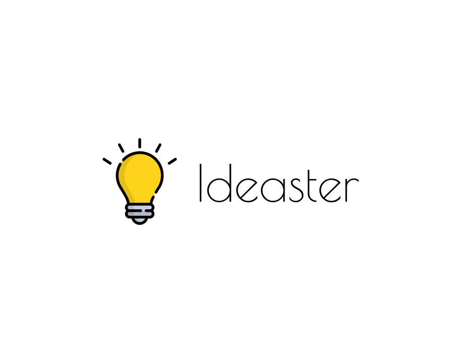
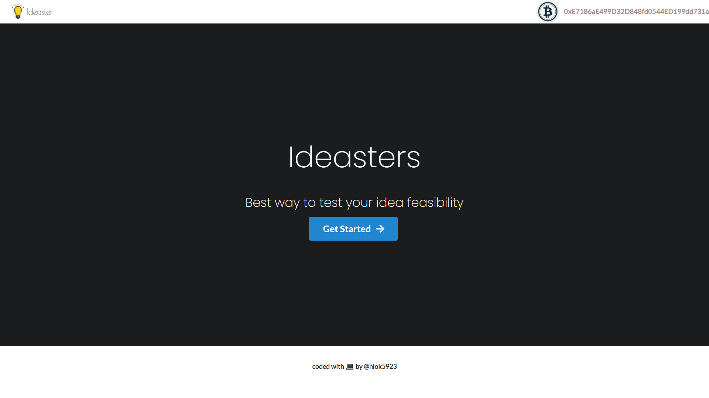

 

 
<h3 align="center"> An idea to test your idea </h3>

 <em> A decentralized way to test your ideas !! </em>.

<h2> 🤔 The Problem it solves  </h2>

Many times it happens that we think about an idea, we discuss it with our friends and get to know their thoughts and opinions over it. But, actually to reach the stage of implementation, we need to make sure that our idea actually has a potential in it. The best experiment for testing potential we can do is testing the relevance of ideas for the group of society who will actually benefit with it or to know the opinions of industry experts who are excelling in that particular domain. On the other hand To get the actual opinions one needs to work at ground level which proves to be an hectic task and not remote friendly. So considering this problem statement we had devised our solution named ideaster (idea + tester) 

<h2>💡 The IDEA: </h2> 

The solution suggests in itself to build a self reliant platform which is open to all people who fall under a specific category and industry experts of certain domains . the user will have two options whether to take a review on it’s idea from industry experts or take the  opinions of it’s target user (to whom the idea is addressed). This platform will be inculcated with multiple categories of peoples users can select from those which categories of people will be mostly benefited with this solution . The user can post a form to the platform and this platform will circulate the form to all those categories selected by the user to give their opinions and in return of providing opinion the form filler will get some sort of incentive.

## Sneak peak: 

 

## Contributing

Any suggestions, improvements or bug reports are welcome.

- If you want to discuss any aspect of the project, please use the [Discussions Tab](https://github.com/nlok5923/Ideaster-BC/discussions).
- You can submit your idea by [opening an issue](https://github.com/nlok5923/Ideaster-BC/issues/new/choose) or [creating a Pull Request](https://github.com/nlok5923/Ideaster-BC/pulls).
- If you'd like to improve the code, make sure you stick to the existing code style and naming conventions.

## License

This project is licensed under the terms of the MIT license.
